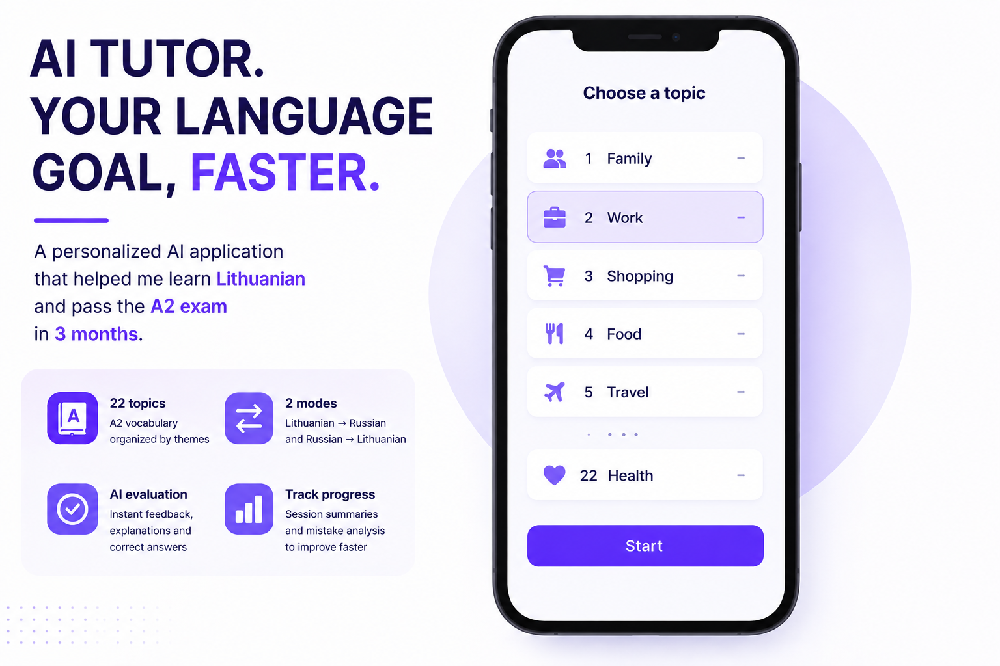
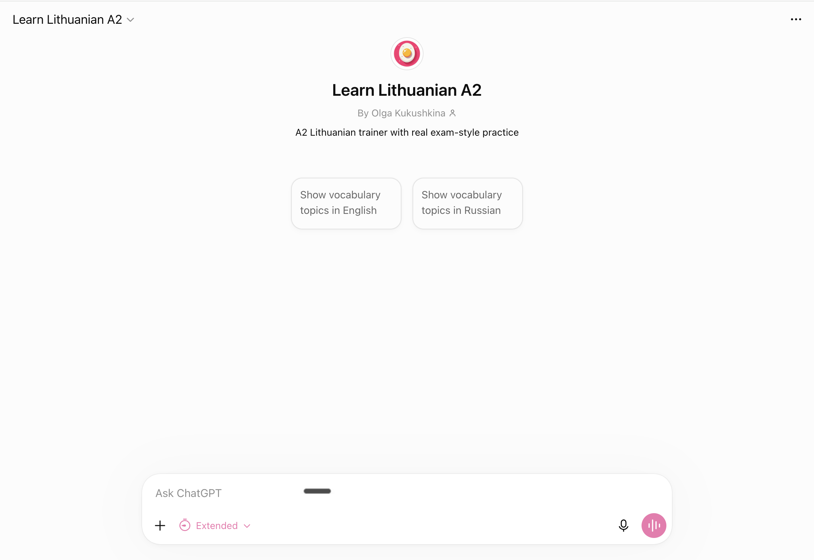
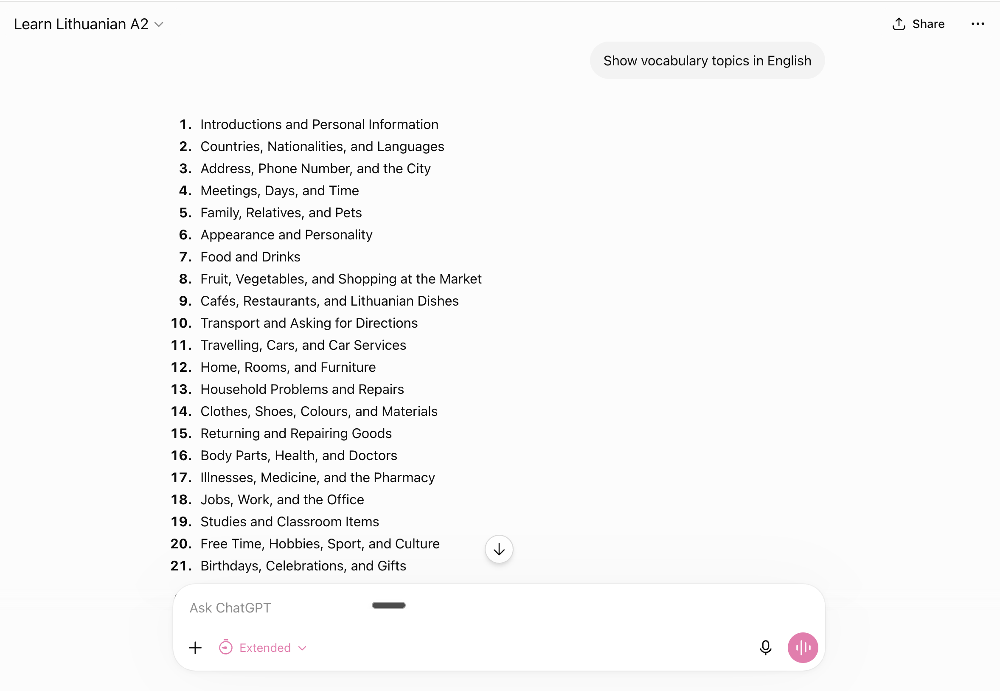
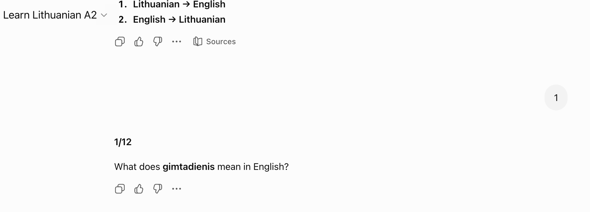

# ai-lithuanian-tutor
A personalized AI language-learning application built to prepare for and pass the Lithuanian A2 exam in three months.

# 🇱🇹 AI Lithuanian Tutor



> **How I used ChatGPT and ElevenLabs to create a personalized Lithuanian learning experience and prepare for the official A2 language exam after relocating to Lithuania.**

---

## Overview

After relocating to Lithuania, I needed to learn the language quickly to prepare for the official A2 language exam.

While there are many language-learning apps, I couldn't find one that matched my learning style or covered the exam topics in the way I needed. Lithuanian also has relatively limited AI support, especially when it comes to natural-sounding pronunciation.

Instead of adapting my learning process to existing tools, I designed a personalized AI-powered learning experience.

Using ChatGPT, I created a custom learning assistant that generates vocabulary lessons, grammar explanations, translation exercises and exam-style quizzes tailored to my progress. To improve pronunciation practice, I used ElevenLabs because the available Lithuanian text-to-speech solutions sounded noticeably less natural.

After approximately three months of daily learning, I successfully passed the official Lithuanian A2 language exam.

---

# The Challenge

Learning Lithuanian presented several practical challenges:

- limited educational content compared to widely spoken languages
- few AI-native learning tools
- poor-quality Lithuanian text-to-speech
- exam preparation requires very specific vocabulary and grammar
- traditional language apps provide mostly static learning content

I wanted a learning experience that could adapt to my progress instead of forcing me into a fixed curriculum.

---

# The Solution

I designed a personalized AI learning system that supports daily Lithuanian practice.

Rather than following predefined lessons, the assistant generates learning materials on demand based on my current goals.

It supports:

- vocabulary grouped by official exam topics
- grammar explanations
- translation exercises
- interactive vocabulary quizzes
- writing practice
- exam-style tasks
- adaptive learning sessions

For pronunciation practice, I generated audio with ElevenLabs, which produced significantly more natural Lithuanian pronunciation than the alternatives I tested.

---

# Application

## Home



The learning assistant starts by selecting vocabulary topics and supports studying through either English or Russian.

---

## Vocabulary Topics



Vocabulary is organized according to the structure of the official Lithuanian A2 exam, making it easy to focus on one topic at a time.

---

## Vocabulary Quiz



Each topic includes interactive translation exercises and quizzes generated dynamically by AI.

---

# AI Workflow

```text
Learning Goal
        │
        ▼
ChatGPT
(Custom Learning Assistant)
        │
        ├── Vocabulary
        ├── Grammar
        ├── Translation Exercises
        ├── Exam-style Quizzes
        ▼
ElevenLabs
(Natural Lithuanian Pronunciation)
        │
        ▼
Daily Practice
        │
        ▼
Official Lithuanian A2 Exam ✅
```

---

# AI Stack

| Tool | Role |
|------|------|
| ChatGPT | Designed and powered the personalized learning assistant |
| ChatGPT | Generated lessons, quizzes, vocabulary and grammar explanations |
| ElevenLabs | Generated natural Lithuanian pronunciation |
| Figma | Explored interface ideas and user experience |

---

# Results

| Outcome | Result |
|---------|--------:|
| Official Lithuanian language exam | ✅ Passed |
| Language level achieved | A2 |
| Learning period | ~3 months |
| Learning experience | Fully personalized |
| Pronunciation | ElevenLabs |
| Learning platform | ChatGPT |

---

# What this project demonstrates

- User-centered product thinking
- Designing personalized learning experiences with AI
- Prompt engineering
- AI workflow orchestration
- Rapid product prototyping
- Selecting the right AI tools for specific user problems
- Turning an idea into a practical solution with a measurable outcome

---

# Why this project matters

This project wasn't created as a demo or coding exercise.

It was built to solve a real problem I faced after relocating to Lithuania: preparing efficiently for the official language exam.

Instead of adapting my learning process to existing software, I designed an AI-powered workflow that matched my own goals and learning style. The result was a personalized learning assistant that helped me successfully pass the official A2 exam.
